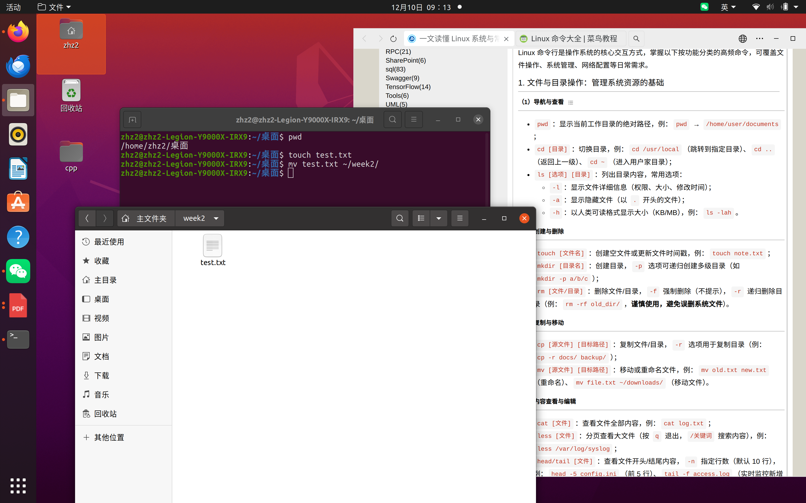
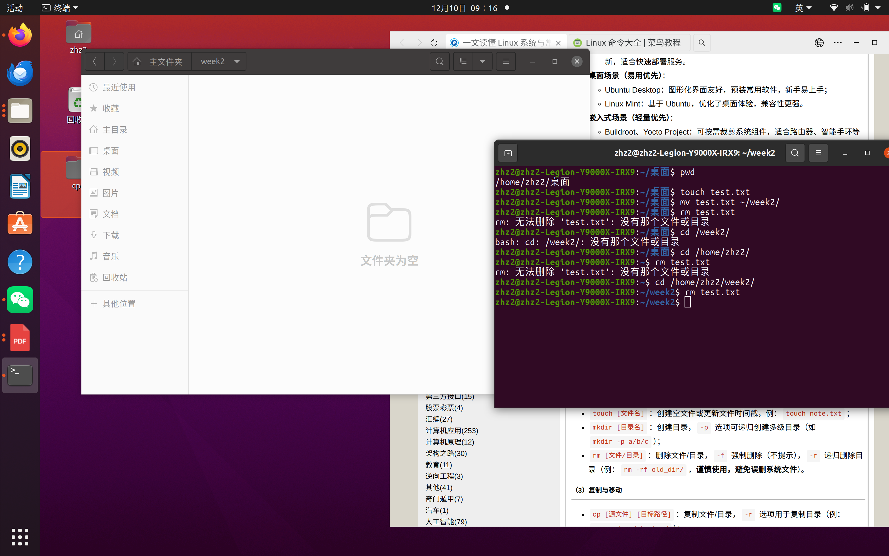
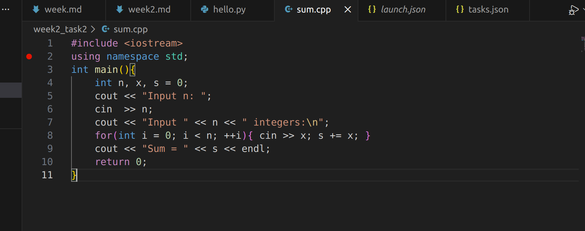
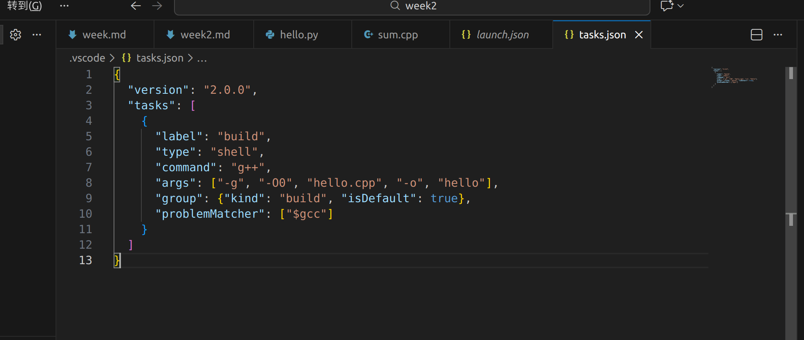
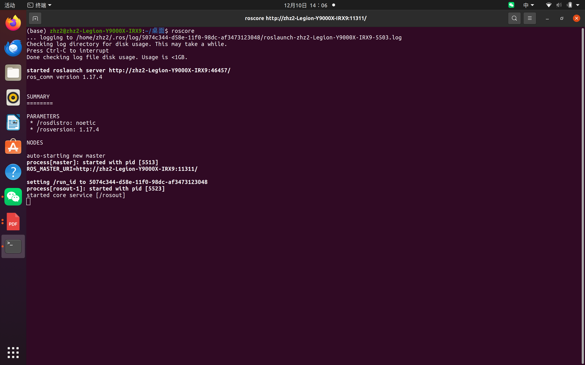
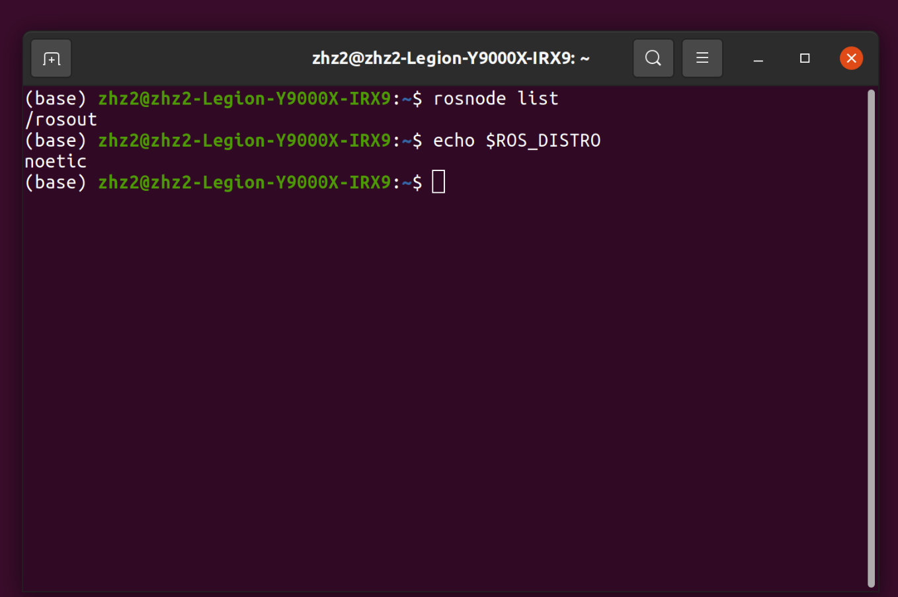
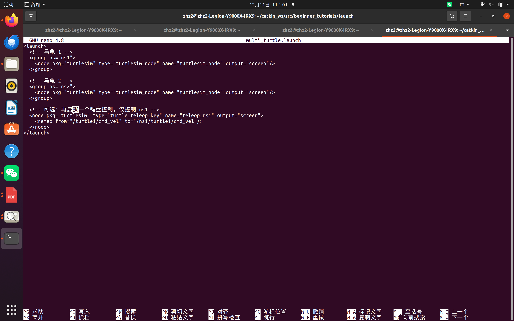
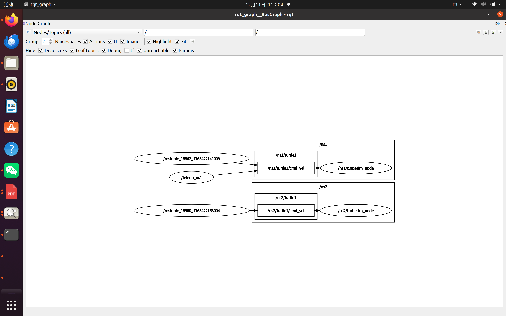
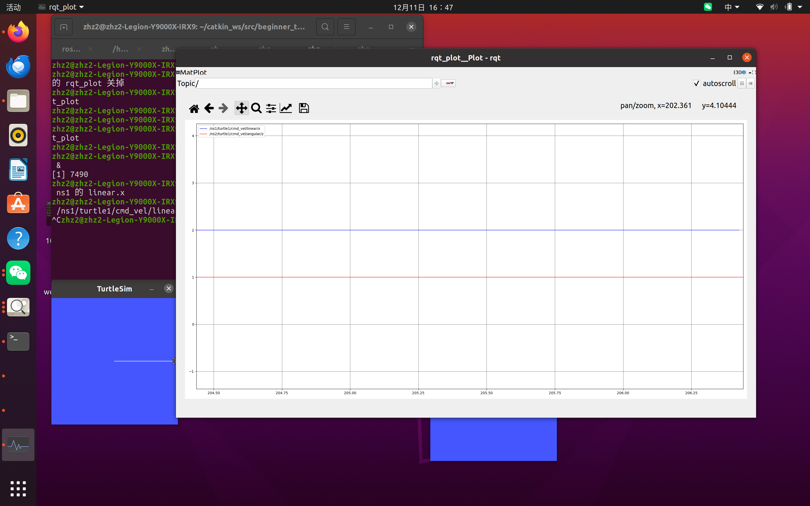

# Week2 实验报告  
**姓名**：z2h2z 
**团队**：TEAM6
**日期**：2025-12-11  

---

## 1 实验目标
- [x] Linux 基础命令  
- [x] Python / C++ 环境搭建  
- [x] ROS1 Noetic 安装与验证  
- [x] Turtlesim 键盘 / 话题 / 程序控制  
- [x] 多乌龟 launch + rqt_graph 可视化  

---

## 2 环境信息
| 项目 | 版本 |
| ---- | ---- |
| Ubuntu | 20.04 |
| ROS | Noetic |
| Python | 3.8.10 |
| G++ | 9.4.0 |

---

## 3 实验过程与截图

### 3.1 Linux 基础
- 创建，移动及删除文件：`touch test.txt` 
   
  
- 安装软件：`sudo apt install tree` 
   
- 进程管理：`ps aux | grep roscore`  

### 3.2 Python / C++ 环境
- Python HelloWorld：`python3 hello.py`
     
- C++ 编译：`g++ -std=c++17 sum.cpp -o sum` 
    
- VSCode 断点调试截图  

### 3.3 ROS 安装验证
- `roscore` 启动  

- `rosnode list`  
- 环境变量 `echo $ROS_DISTRO`  

### 3.4 CATKIN 工作空间与功能包
- `catkin_make` 成功  
- `beginner_tutorials` 包  
- HelloWorld 节点运行  

### 3.5 Turtlesim 基础控制
#### 5.1 键盘控制
- `rosrun turtlesim turtle_teleop_key`  
#### 5.2 rostopic 直线
- `rostopic pub /turtle1/cmd_vel ...`  

#### 5.3 程序画圆
- 运行 `draw_circle.py`  

### 3.6 多乌龟 launch + rqt
-launch

#### 5.4a 通信图
- `rqt_graph`   

- `rqt_plot`  

#### 5.4b 双轨迹(rostopic pub 命令)
- turtle1 直线 + turtle2 转圈  

---

